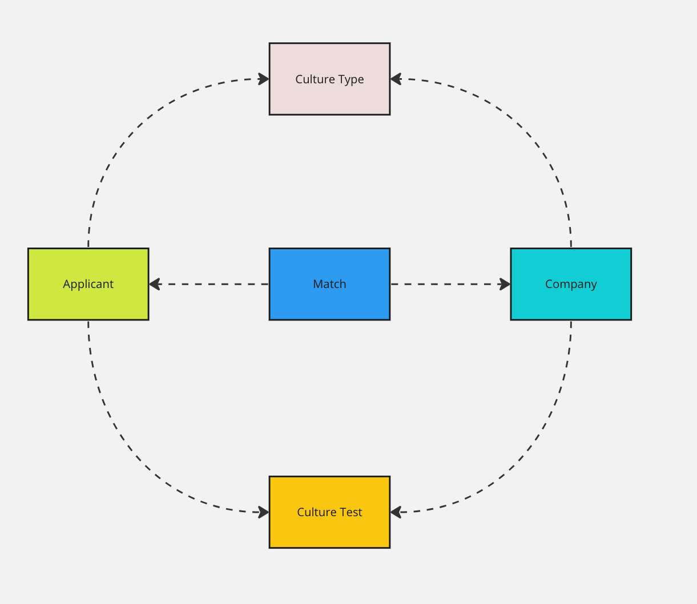

# Empion - Full-Stack Challenge

## Context

On our mission to automate headhunting and connect applicants with the best company cultures, a customer of ours requested a new product. The Empion Culture Matcher.

## Your goal

Your goal is to create a full-stack application - the Empion Culture Matcher.

The application should be composed of:

- A Backend API
- A Web client

## Delivery

We expect you to deliver the soultion in a public Github repository. We should be able to clone this repository and run the solution based on the instructions.

### Time investment and planning

We appreciate you are investing your time to work on this solution. We don't wan't you to create a production ready application, therefore, keep in mind the principle of "make it work, make it right, make it fast/pretty". 

It should be your priority to deliver a functional, and as complete as possible, solution first, followed by a sophisticated/super well architected solution, followed by outstanding UX.

The decision of when to stop and consider your solution ready to deliver is up to you. However, pay attention to the evaluation criteria described below. The more your solution aligns with the evaluation criteria, the better your evaluation will be.

## Evaluation criteria

- Completeness: Were all the requirements implemented? If not, the partial solution is coherent and functional?
- Documentation: Is the project documented? Were we able to run the solution based on the given instructions?
- Architecture: Is the solution overengineered? Were the architecture decisions justified in the documentation?
- Quality: Is the solution properly tested? Were the most relevant parts covered by automated testing?
- Code: Is the code easy to understand? Were complex decisions in the code justified in the documentation?

## The Domain Model

Here's an overview of the domain model of the application:

Note: Feel free to adapt the model in case you feel it can be improved.

### Models attributes

**Culture Type**

- id: integer
- name: string, required
- lower_end: integer, required
- upper_end: integer, required

Validation:

- The `lower_end` and `upper_end` should not overlap between culture types.

Validation example:

- Culture Type A: `lower_end`=1, `upper_end`=10
- Culture Type B: `lower_end`=9, `upper_end`=15 ==> Invalid! as 9 overlaps with the Culture Type A's `upper_end` value.

**Applicant**

- id: integer
- first_name: string, required
- last_name: string, required
- culture_type: string (default: `undefined`, one of "culture_types")

**Company**

- id: integer
- name: string, required
- city: string, required
- culture_type: string (default: `undefined`, one of "culture_types")

**Culture Test**

- id: integer
- type: string (one of "applicant", "company"), required
- respondent_id: integer, "The ID of the respondent. Either applicant, or company, depending on the type of the test", required
- answer_one: integer
- answer_two: integer
- answer_three: integer
- answer_four: integer
- answer_five: integer
- answer_six: integer
- answer_seven: integer
- answer_eight: integer
- result: integer
- created_at: timestamp
- completed_at: timestamp

Validations:

- answer value must be between 1 and 5 (inclusive)
- the culture test cannot be completed until all answers are provided and the result is computed.

## The Backend API

## General requirements

- All timestamps should be stored in the DB in UTC (with timezone information).
- All timestamps should be presented in responses in ISO8601 format.
- API architecture: REST.
- API documentation: OpenAPI.
- Database: PostgreSQL.
- Your solution should be properly tested (all tests should be passing).
- Your solution should be properly documented (we should be able to run it based on your instructions without any issues).
- Your solution should be linted (We recommend using Rubocop for that).

### Specific Requirements

- Framework: Ruby on Rails (API)
- Language: Ruby

## Extra mile

- A dockerized solution would be very much appreciated.

## Out of scope

- Any form of authentication
- Any form of data encryption

## The Web Client

## Product requirements

- It should be possible to create culture types
- It should be possible to list culture types

- It should be possible to create companies
- It should be possible to create applicants

- It should be possible to visualise the list of companies
- It should be possible to visualise the list of applicants

- It should be possible to answer an applicant culture test
- It should be possible to answer a company culture test

- It should compute the culture test result when the test is completed
- It should update the company culture type once the culture test is completed and the result is calculated
- It should update the applicant culture type once the culture test is complete and the result is calculated

- As an applicant, it should be possible to visualise my matches
- As a company, it should be possible to visualise my matches

## Business rules

### Computation of the culture test result

- Given a culture test is completed, then the result should be calculated by computing the average of all answer values for that test.
- Given a completed culture test, when the result is computed, the culture type of the respondent should be updated to the culture type that includes the test result between the `lower_end` and `upper_end`.

### General requirements

- All timestamps should be present in the user's timezone.
- Your solution should be properly tested (all tests should be passing).
- Your solution should be properly documented (we should be able to run it based on your instructions without any issues).
- Your solution should be linted (We recommend using Prettier for that).
- You are free to build your own components or use a component library of your choice.
- The UI does not need to be fancy, but it needs to be functional and meet the requirements.

### Specific Requirements

- Framework: ReactJS
- Language: JS or Typscript (whatever you feel more confortable with)
- Test framework: We recommend using Jest (not mandatory, you can choose the one you're more familiar with)
